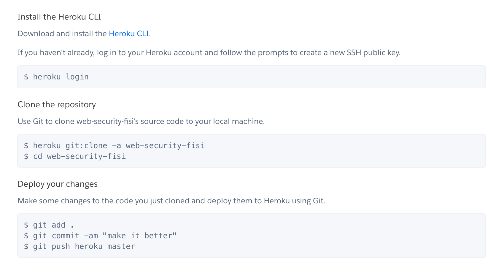

# WEB SECURITY
  Proyecto de Platafor Web de Control de Exámenes virtuales con Reconocimiento Facial.

## DEPLOY
  - Download and install the [heroku/cli](https://devcenter.heroku.com/articles/heroku-cli#download-and-install).
  - From root ```cd WebSecurity/DESARROLLO/PWCEV/Front/web```. This repo is only for deploy.
  - Steps to deploy 
    